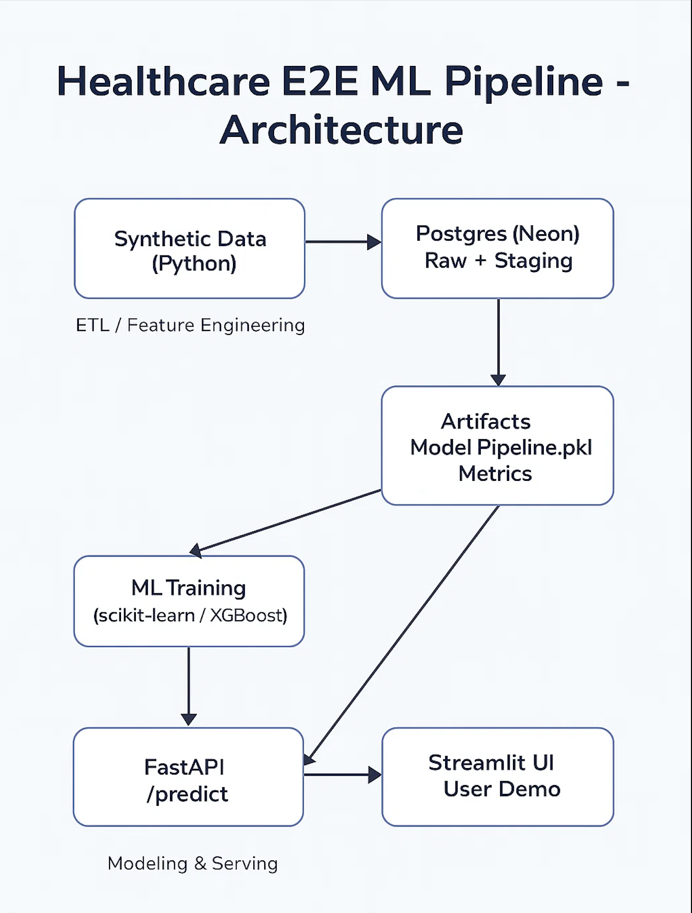

# Healthcare E2E ML Pipeline

An end-to-end machine learning + data engineering project simulating hospital 30-day readmission prediction.
It demonstrates how to take raw healthcare data → transform with SQL/dbt → train a model → serve predictions with FastAPI → and visualize insights in Tableau.

<p align="center">  </p>

---

## Components

- Synthetic Data (Python) – patients, encounters, labs
- Postgres (Neon) – cloud DB for raw & staging tables
- dbt – SQL transformations → feature mart for ML
- ML (scikit-learn / XGBoost) – training, metrics, artifacts
- FastAPI – /predict endpoint serving serialized pipeline
- Streamlit – lightweight UI calling the API
- Tableau Public – KPIs & model insights

---

## Repo Structure
```
.
├── app/                  # Streamlit UI
├── artifacts/            # Saved model pipeline (.pkl)
├── exports/
│   ├── features/         # train/val/test CSVs + meta.json
│   └── bi/               # CSVs for Tableau
├── healthcare_dbt/       # dbt project (staging + marts)
├── src/
│   ├── etl/
│   │   ├── seed_synthetic.py
│   │   ├── make_features.py
│   │   └── export_for_bi.py
│   ├── ml/
│   │   └── train.py
│   └── serve/
│       └── main.py       # FastAPI app
├── .env.example          # Template
├── requirements.txt
├── Dockerfile            # for Render deploy
└── README.md

```

---

## Quick Start

1) Setup
python -m venv .venv
source .venv/bin/activate
pip install -r requirements.txt

2) Create & seed DB (Neon URL in .env)
python src/etl/seed_synthetic.py

3) Run dbt transformations
cd healthcare_dbt
dbt debug
dbt run
dbt test
cd ..

4) Make features & train model
python src/etl/make_features.py
python src/ml/train.py

5) Serve API locally
uvicorn src.serve.main:app --reload --port 8000.
- Test: curl http://127.0.0.1:8000/health

6) Export CSVs for Tableau
python src/etl/export_for_bi.py

---

### Sample Prediction

Send a POST request to the `/predict` endpoint:

```bash
curl -X POST "http://127.0.0.1:8000/predict" \
  -H "Content-Type: application/json" \
  -d '{
        "sex": "F",
        "age": 67,
        "length_of_stay_days": 3.4,
        "avg_hemo": 12.5,
        "avg_glucose": 140,
        "avg_creatinine": 1.1,
        "avg_wbc": 8.3,
        "avg_platelets": 230
      }'
```
### Sample Response
```
{
  "readmission_probability": 0.18,
  "predicted_class": "No Readmission",
  "model_version": "v1.0"
}
```

---

## Results

- 396 encounters processed
- Readmission rate ≈ 15%
- Baseline model: Logistic Regression
- Tableau: cohort KPIs + feature importance - [Tableau Public](https://public.tableau.com/views/overview_17567703623580/Readmission-Overview?:language=en-GB&publish=yes&:sid=&:redirect=auth&:display_count=n&:origin=viz_share_link)

<p align="center">
  <a href="https://public.tableau.com/views/your-dashboard-url">
    
  </a>
</p>

---

## Author

Tanvi Kaurwar
[LinkedIn](https://www.linkedin.com/in/tanvi-kaurwar-779b501b0/)
